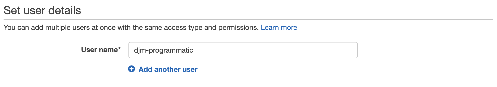
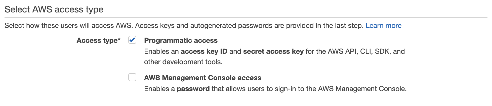
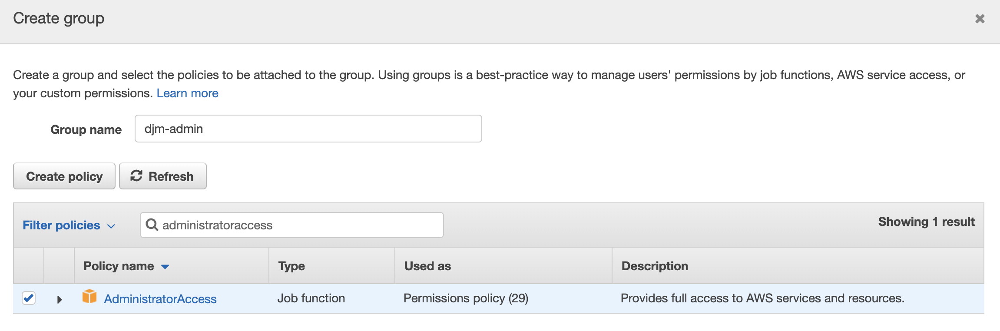

# Setup

## Getting Started

### Windows

1. Install the [AWS CLI](https://s3.amazonaws.com/aws-cli/AWSCLI64PY3.msi)
2. Install the [AWS SAM CLI](https://github.com/awslabs/aws-sam-cli/releases/latest/download/AWS_SAM_CLI_64_PY3.msi)
3. Install [Putty](https://the.earth.li/~sgtatham/putty/latest/w64/putty-64bit-0.72-installer.msi)

> **Assumption:** all downloads are 64-bit distributions.

> **Note:** Full instructions available [here](https://docs.aws.amazon.com/serverless-application-model/latest/developerguide/serverless-sam-cli-install-windows.html).

### MacOS

1. Install [Homebrew](https://brew.sh/)
2. Open Terminal
3. Run: `brew tap aws/tap`
4. Run: `brew install aws-cli`
5. Run: `brew install aws-sam-cli`

> **Note:** Full instructions available [here](https://docs.aws.amazon.com/serverless-application-model/latest/developerguide/serverless-sam-cli-install-mac.html).

## Create IAM User

In this section we will create a new IAM user with liberal programmatic access to our account. This IAM user will be used by the AWS CLI tools to interact with our account.

* Open the [AWS IAM Dashboard](https://console.aws.amazon.com/iam/home?region=us-east-2#/home)
* Go to "Users"
* Click "Add User"
* Enter a unique username (ex. `djm-programmatic`)

* Select "Programmatic Access" only

* Click "Next"
* Click "Create Group"
* Create a group with a unique name (ex. `djm-admin-group`) and provide it with the `AdministratorAccess` policy

* Proceed with "Next" until you "Create User"
* Download the CSV file

## AWS CLI Configuration

Opening a shell (e.g. command prompt or terminal) run the following:

```bash
aws configure
```

You will be prompted to provide an Access Key and Access Secret - these can be found in the CSV file you downloaded for your IAM user.

## [Next »](../01_Buckets/README.md)
