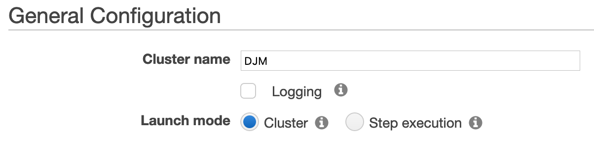
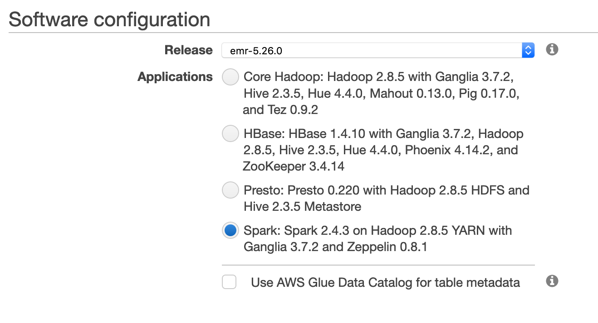
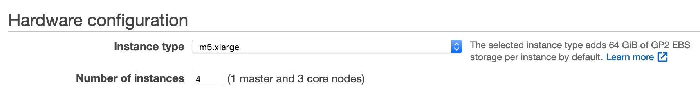
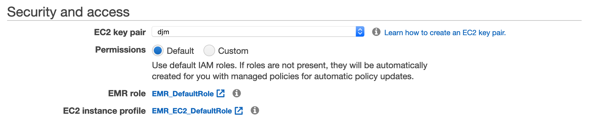

# Creating an EMR Cluster

In this section we'll go through the process of setting up an EMR Cluster.

> **What is EMR?**
>
> This is Amazon's managed service offering built atop several open source frameworks (Spark, Hive, HBase, Flink, and Presto). It's purpose is to simplify the workflow and optimize the cost of deploying and running these tools at scale.
>
> Additionally, it comes preconfigured with native access to other AWS products, such as S3. [Read more »](https://aws.amazon.com/emr/)


## Setup EC2 Key Pair

1. Go to the [AWS **EC2** Dashboard](https://us-east-2.console.aws.amazon.com/ec2)
2. From the menu select "Key Pairs"
3. Click "Create Key Pair"
4. Give it a unique name (ex. `djm-key-pair`)
5. You will be prompted to download the key pair
6. Save the key pair somewhere easily accessible

## Setup an EMR Cluster

1. Go to the [AWS **EMR** Dashboard](https://us-east-2.console.aws.amazon.com/elasticmapreduce)
2. Click "Create Cluster"
3. Give your cluster a unique name (ex. `DJM`)

4. Under "Software configuration" select `Spark: [...]`

5. Under "Hardware configuration" select `m5.xlarge`
6. Under "Hardware configuration" set "Number of Instances" to `4`

7. Under "Security and access" select your "EC2 key pair"


## Connect to the EMR Master

Once your cluster is in a `provisioned` state. You can click on "SSH" next to "Master public DNS" to retrieve the SSH connection string. You can copy this command and simply update the path to your PEM file (created earlier by the key pair step).

> **Tip:** You can use the AWS CLI to connect using the unique identifier of your cluster:
> ```bash
> aws emr ssh --cluster-id <ID> --key-pair-file ~/path/to/file.pem
> ```

### Windows - `adding extra steps since 1985` 👎

On Windows we need to perform a few extra steps in order to connect if we are just using a tool like PuTTY.

1. From the start menu find "PuTTYgen"
2. Click "Load"
3. In the bottom right dropdown, change from "PuTTY Private Key [...]" to "All Files"
4. Browse to where you stored your EC2 Key Pair file
5. Open the file
6. You should receive a message "Successfully imported [...]"
7. Click "Save private key"
8. Save to an easy to access location

```console
aws emr ssh --cluster-id <ID> --key-pair-file C:\path\to\file.ppk
```

## [Next »](../03_FDA_Labels/README.md)
