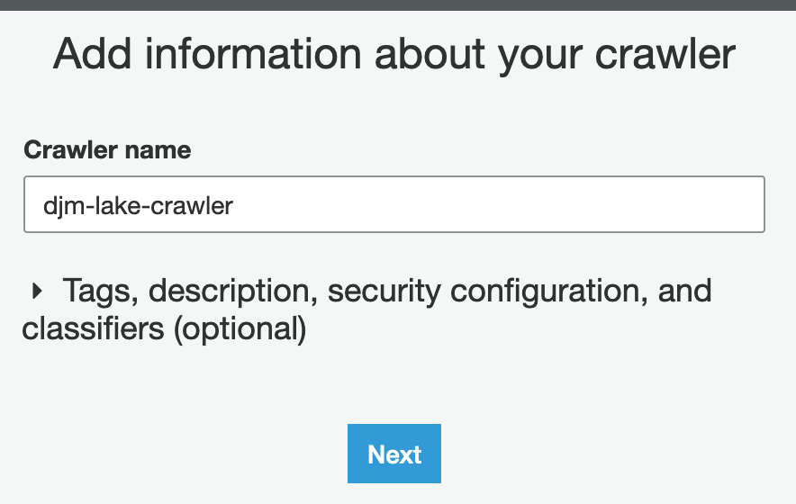
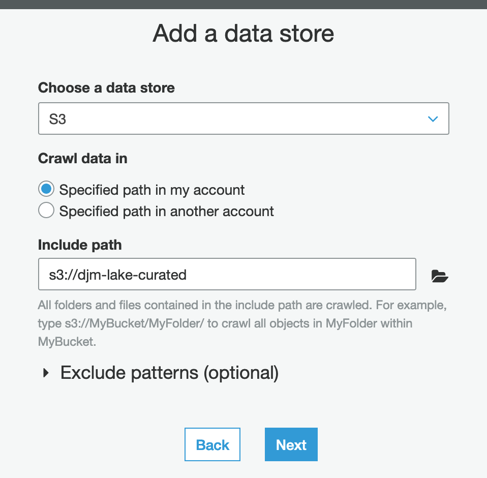
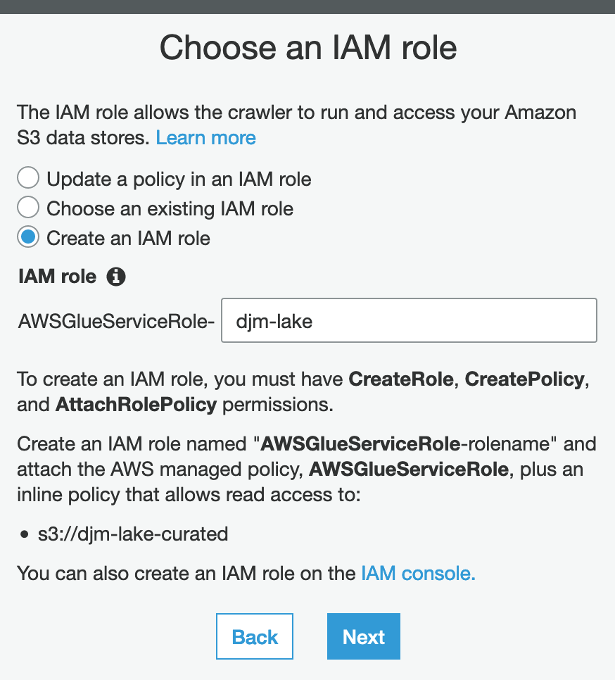
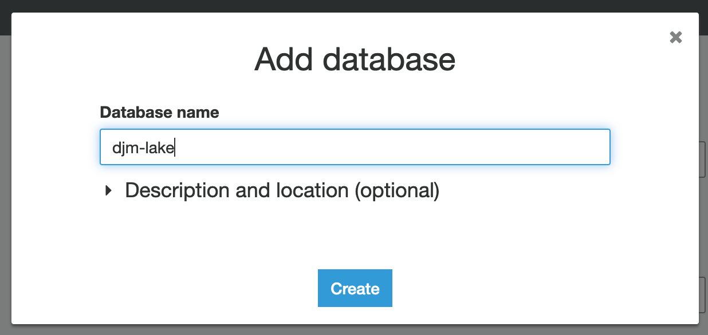
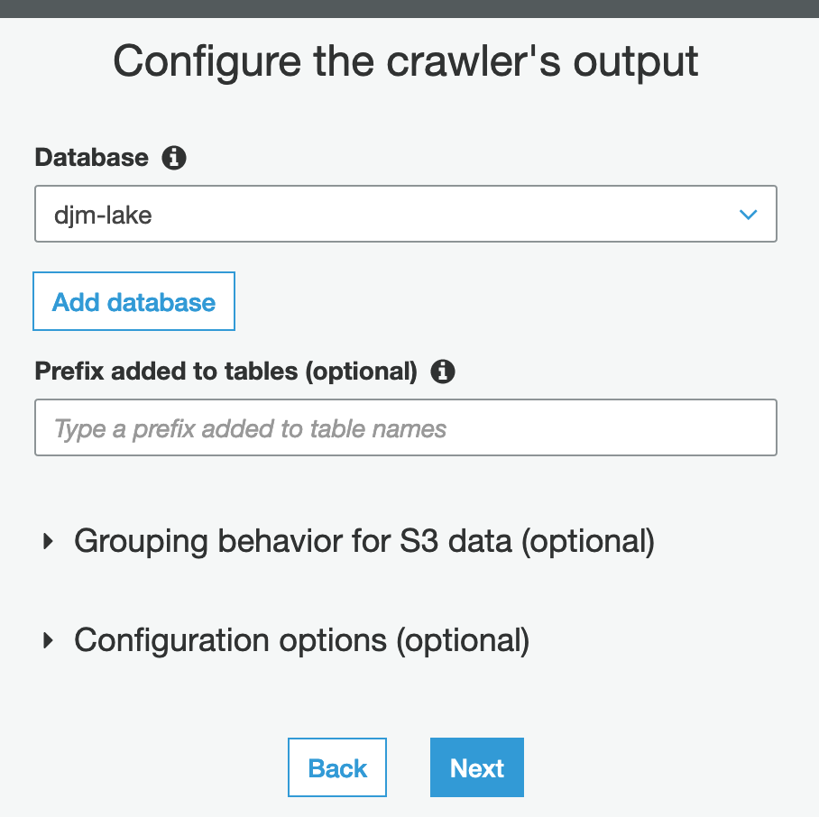

# Setup a Glue Crawler

In this section we will introduce you to [AWS Glue](https://aws.amazon.com/glue/). Specifically we will focus on creating a Glue Crawler to automagically create a data catalog and query interface via AWS Athena.

> **What is Glue Crawler?**
>
> It is part of a bigger suite of products wrapped up into the [AWS Glue](https://aws.amazon.com/glue/) product. Glue, as the name suggests, helps you bring several AWS products together into a single interface. This includes EMR, Athena, and Redshift.
>
> A component of Glue is the "Catalog." This stores our metadata. It is through this metadata that we can define the source, format, and schema of data. In our case, we know the source is S3 and that the format is Parquet **but** we don't yet have a definition of the schema.
>
> This is where Glue Crawler comes in. As our data is highly structured, a Glue Crawler can automatically infer the schema and save us the time of defining it manually.

## Create a Glue Crawler

1. From the AWS Glue Dashboard
2. Click "Add Crawler"
3. Give the crawler a unique name (ex. `djm-lake-crawler`)

4. Proceed with "Next" until you reach "Add a Data Store"
5. Select your "Curated" data lake bucket from S3 (ex. `djm-curated`)

6. Proceed with "Next" until you reach "Choose an IAM Role"
7. Select "Create an IAM Role"
8. Give it a unique name (ex. `djm-lake`)

9.  Proceed with "Next" until you reach "Configure the crawler's output"
10. Click "Add database"

11. Give it a unique name (ex. `djm-lake`)

12. Proceed & finish

## Run The Crawler

1. From the [AWS Glue Crawler Dashboard](https://us-east-2.console.aws.amazon.com/glue/home?region=us-east-2#catalog:tab=crawlers)
2. Click on your newly created Crawler
3. Click "Run crawler"

The Crawler will now do the following:

1. Look at the configured S3 bucket
2. Identify blobs it can consume
3. Automatically infer common data structures
4. Populate your configured AWS Athena database with tables for the data identified

## [Next »](../05_Athena/README.md)
