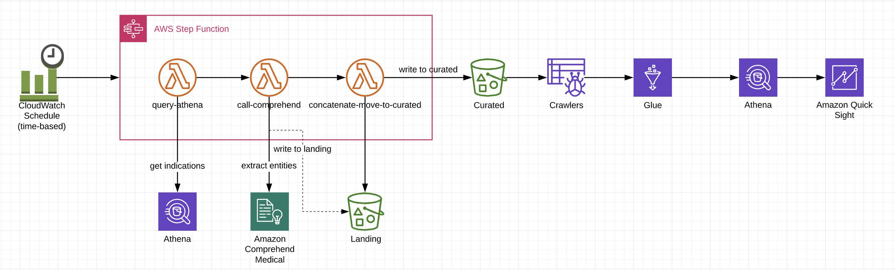

# Comprehend Medical Serverless Workflow Repository

## Architecture



## Outline
1. Build basic lambda function
2. Why use a framework such as Serverless or SAM?
3. Quick overview of Comprehend Medical interface
4. Comprehend Medical pipeline demo (Step Function)
5. Deploy Comprehend Medical pipeline


## Setup
#### S3 Bucket
* Create a S3 bucket for the comprehend pipeline. e.g. ```jr-comprehend```

#### Folder structure
Create the following folders in your buckets
- ```jr-comprehend```
    - create folder ```uploadsfolder```
    - create folder ```athenaoutput```

- ```jr-landing```  (use your landing bucket)  
    - create folder ```fda-product-indications```

#### Repository
* Make sure you have the latest code from the repository. Run ```git pull``` in your terminal.
* *IMPORTANT: Replace bucket name in serverless.yml to your bucket.*

#### Layers
We will use the boto3 (updated version), pandas and numpy layers in our lambda functions.

- Use the following settings to create the layers in your lambda console.
```
Name : boto3layer
Upload a file from Amazon S3 : https://s3.amazonaws.com/comprehend-layers/boto3layer.zip
Compatible runtimes : python3.6
```
--> Save the boto3 layer ARN

```
Name : pandas-xlrd-layer-Python36-Pandas23x
Upload a file from Amazon S3 : https://s3.amazonaws.com/comprehend-layers/pandas-xlrd-layer-Python36-Pandas23x.zip
Compatible runtimes : python3.6
```
--> Save the pandas layer ARN

(Note: We do not need to create numpy layer. Numpy layer is available within AWS Lambda.)
```
Numpy
get ARN from a sample lambda
```
#### Part 1 - Demo Lambda
#### Layer References
* Add the following layers to the Lambda function to use Numpy and Pandas libraries:
```
<numpy layer ARN>
<pandas layer ARN>
```

#### Part 2 - Deploy Comprehend Medical pipeline
#### Install Serverless Framework
* Install nodejs from https://nodejs.org/en/download/

* Install serverless framework
    ```
    npm install -g serverless
    ```
* Check serverless version
    ```
    serverless --version
    ```

Reference: https://serverless.com/framework/docs/providers/aws/guide/installation/

#### Plugins
* *change directory to comprehend-service folder in your terminal.*
* install following plugins
```
npm install --save-dev serverless-step-functions

npm install serverless-pseudo-parameters
```
#### replace bucket names
#### replace layer arn
```
arn:aws:lambda:us-east-1:990712811979:layer:boto3layer:2
arn:aws:lambda:us-east-1:990712811979:layer:pandas-xlrd-layer-Python36-Pandas23x:2
arn:aws:lambda:us-east-1:668099181075:layer:AWSLambda-Python36-SciPy1x:2  (get this from a lambda)
```
#### Deploy
```
serverless deploy --verbose --force
```

## [Next »](../07_FDA_Product_Indications/README.md)
