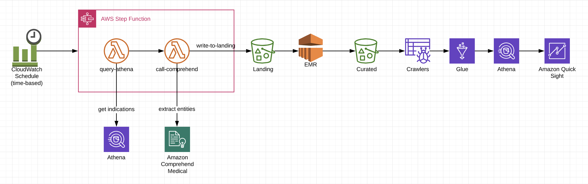

# Comprehend Medical Serverless Workflow Repository

## Architecture



## Outline
1. Build basic lambda function
2. Why use a framework such as Serverless or SAM?
3. Quick overview of Comprehend Medical interface
4. Comprehend Medical pipeline demo (Step Function)
5. Deploy Comprehend Medical pipeline


## Setup
#### S3 Bucket
* We will use the bucket created during step '01_Buckets' for this section
* Create following folders in your bucket:
    * athenaoutput
    * comprehendoutput
    * uploadsfolder

#### Repository
* Make sure you have the latest code from the repository. Run ```'git pull'``` in your terminal.
* *IMPORTANT: Replace bucket name in serverless.yml to your bucket.*

#### Install Serverless Framework
* Install nodejs from https://nodejs.org/en/download/

* Install serverless framework
    ```
    npm install -g serverless
    ```
* Check serverless version
    ```
    serverless --version
    ```

Reference: https://serverless.com/framework/docs/providers/aws/guide/installation/

#### Plugins
* *change directory to comprehend-service folder in your terminal.*
* install following plugins
```
npm install --save-dev serverless-step-functions

npm install serverless-pseudo-parameters
```
#### Folder structure
create bucket
- 'jr-comprehend'
    - create folder 'athenaoutput'

- 'jr-landing'  (use your landing bucket)  
    - create folder 'fda-product-indications'

#### Layers
We will use the boto3 (updated version), pandas and numpy layers in our lambda functions.

- Use the following settings to create the layers in your lambda console.
```
boto3layer
https://s3.amazonaws.com/comprehend-layers/boto3layer.zip
python3.6
```
```
pandas-xlrd-layer-Python36-Pandas23x
https://s3.amazonaws.com/comprehend-layers/pandas-xlrd-layer-Python36-Pandas23x.zip
python3.6
```

(Note: We do not need to create numpy layer. Numpy layer is available within AWS Lambda.)
```
Numpy
arn:aws:lambda:us-east-1:668099181075:layer:AWSLambda-Python36-SciPy1x:2
```

#### Part 1 - Demo Lambda
#### Layer References
* Add the following layers to the Lambda function to use Numpy and Pandas libraries:
```
arn:aws:lambda:us-east-1:259788987135:layer:AWSLambda-Python36-SciPy1x:2
arn:aws:lambda:us-east-1:874346574520:layer:pandas-xlrd-layer-Python36-Pandas23x:5
```


#### Deploy
```
serverless deploy --verbose --force
```

## [Next »](../07_FDA_Product_Indications/README.md)
