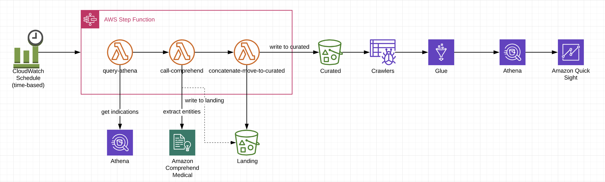

# Comprehend Medical Serverless Workflow Repository

## Architecture



## Outline
1. Build basic lambda function
2. Why use a framework such as Serverless or SAM?
3. Quick overview of Comprehend Medical interface
4. Comprehend Medical pipeline demo (Step Function)
5. Deploy Comprehend Medical pipeline


## Setup
#### S3 Bucket
* We will use the bucket created during step '01_Buckets' for this section
* Create following folders in your bucket:
    * athenaoutput
    * comprehendoutput
    * uploadsfolder

#### Repository
* Make sure you have the latest code from the repository. Run 'git pull' in your shell
* *IMPORTANT: Replace bucket name in serverless.yml to your bucket.*

#### Demo Lambda function references
Add the following layers to the Lambda function to use Numpy and Pandas libraries:

arn:aws:lambda:us-east-2:259788987135:layer:AWSLambda-Python36-SciPy1x:2

arn:aws:lambda:us-east-2:874346574520:layer:pandas-xlrd-layer-Python36-Pandas23x:5

#### Install Serverless Framework
* Install nodejs from https://nodejs.org/en/download/

* Install serverless framework
    ```
    npm install -g serverless
    ```
* Check serverless version 
    ```
    serverless --version
    ```

Reference: https://serverless.com/framework/docs/providers/aws/guide/installation/

#### Plugins
* change directory to comprehend-service folder in your terminal.
* install following plugins
```
npm install --save-dev serverless-step-functions

npm install serverless-pseudo-parameters
```

#### Deploy
```
serverless deploy --verbose --force
```